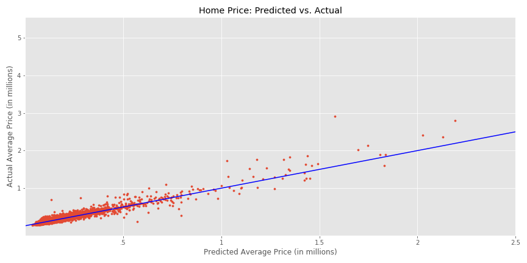
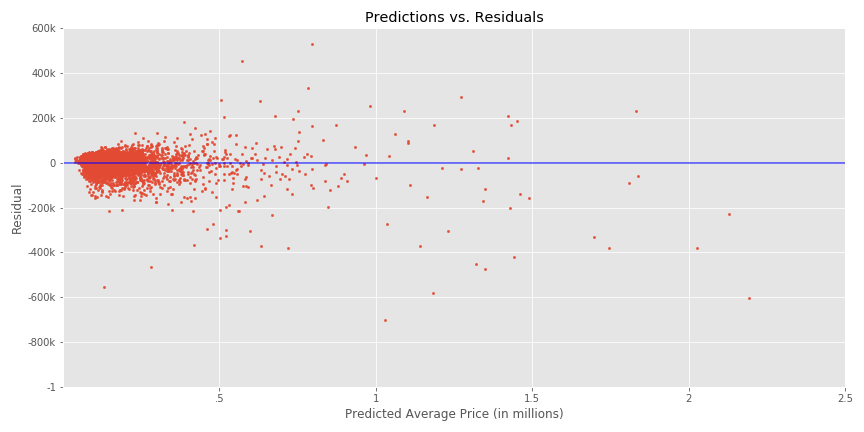

# Where Should I Live?

## Table of Contents
[1.0 Directory Structure](#10-Directory-Structure)<br>
[2.0 Executive Summary](#20-Executive-Summary)<br>
[3.0 Description of Data](#30-Description-of-Data)<br>
-[3.1 Size](#31-Size)<br>
-[3.2 Sources](#32-Sources)<br>
-[3.3 Data Dictionary](#33-Data-Dictionary)<br>
[4.0 Data Visualization](#50-Data-Visualization)<br>
[5.0 Conclusion + Next Steps](#60-Conclusion-+-Next-Steps)<br>

## 1.0 Directory Structure

```
.
├── capstone
    ├── code
        ├── crime_scraper.ipynb
        ├── school_scraper.ipynb
        ├── gini_unemp_homes.ipynb
        ├── modeling.ipynb
        ├── capstone_app.py
        ├── templates
            ├── form1.html
            ├── results1.html
    ├── data
        ├── census_data.csv
        ├── gini.csv
        ├── home_values.csv
        ├── hs_completion.csv
        ├── inc.csv
        ├── poverty_rates.csv
        ├── testinc.csv
        ├── unemp_rates.csv
        ├── uscities.csv
        ├── uszips_data.csv
    ├── pkl
        ├── inc.pkl
        ├── inc2.pkl
        ├── education.pkl
    ├── plots
        ├── rf.png
        ├── resid.png
    ├── extra
        ├── modelingcopy.ipynb
        ├── testresponse.ipynb
    ├── README.md
    └── capstone_slides.pdf
```

## 2.0 Executive Summary

The "Where Should I Live?" app is an online interactive tool designed to help users find the best deals on homes. There are many online resources already available that can display the cheapest homes in a given area. This app uses machine learning to improve upon this idea. Using data gathering techniques like web scraping, a dataset of over 5,000 U.S. municipalities was assembled, with many features including crime rate per capita, Gini coefficient, and population density. A random forest regression model was trained to predict the average home price per town. The app operates by first filtering the data based on the user's constraints, then sorting by the residuals between predicted average home price and actual average home price. In this way, the app displays the towns that have the best "deals" on home price.

---
## 3.0 Description of Data

### 3.1 Size

|dataset|num. rows|num. columns|file size|
|---|---|---|---|
|census_data.csv|33121|243|34 MB|
|gini.csv|839|4|52.9 kB|
|home_values.csv|30442|293|48.8 kB|
|poverty_rates.csv|29638|3|1.87 MB|
|unemp_rates.csv|839|282|1.51 MB|
|uscities.csv|28889|19|5.34 MB|
|uszips_data.csv|33099|18|6 MB|
|inc.csv|21167|22|3.17 MB|
|testinc.csv|5371|26|1.45 MB|


### 3.2 Sources

- https://data.census.gov/cedsci/
- https://simplemaps.com/data/us-zips
- https://www.cityrating.com/crime-statistics/
- https://www.greatschools.org/
- https://www.zillow.com/research/data/
- https://factfinder.census.gov/faces/nav/jsf/pages/index.xhtml

### 3.3 Data Dictionary

|Feature|Type|Description|
|---|---|---|
|townstate|object|Name of town and its state|
|poverty|float|Percentage of residents living below the poverty line|
|med_income|float|Median income among town residents|
|hs_completion|float|Percentage of residents who have completed high school|
|n_households|int|Count of homes in the town|
|population|int|Count of residents in town|
|density|float|Estimated individuals per square kilometer|
|crime_rate|int|Count of total crime incidents in 2016|
|property_crime|int|Count of property crime incidents in 2016|
|violent_crime|int|Count of violent crime incidents in 2016|
|crime_rate_pc|float|Crime rate per capita|
|property_crime_pc|float|Property crime per capita|
|violent_crime_pc|float|Violent crime per capita|
|people_per_household|float|population / n_homes|
|state|object|Name of state|
|students_per_teacher|float|Average student to teacher ratio for all schools in town|
|lat|float|Town location in degrees latitude|
|lng|float|Town location in degrees longitude|
|gini|float|Gini coefficient: measure of wealth inequality or relative poverty|
|unemployment_rate|float|Proportion of unemployed individuals|
|home_price|float|Actual average home price|
|preds|float|Average home price predicted by our model|
|residuals|float|Difference between predicted and actual average home price|

---
## 4.0 Data Visualization

 
 

## 5.0 Conclusion + Next Steps

This project was largely an exercise in data gathering. Many sources had to be assembled, and many formats had to be reconciled. Some data tables were downloaded from the US census online interactive table builder, and other online resources. These were formatted typically by zip code, town, or county. Data at levels too granular such as zip code had to be grouped by town and aggregated by either mean or sum, depending on the feature. In addition, there were two major web scraping operations: one for the crime data, and one for the schools data. Given these challenges, and the fact that web scraping is inherently unreliable, the model performed remarkably on the testing data with an R2 of 0.85. The best performing model was the random forest regressor. Still, the app is more of an initial idea than a finished product. A more complete product would include more specific constraints for the user to input, as well as more information about the towns displayed. 

---